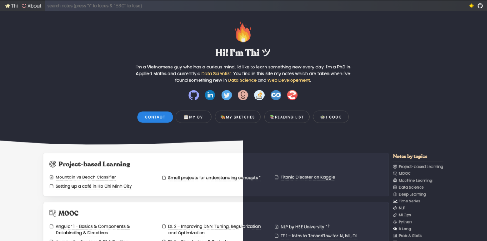
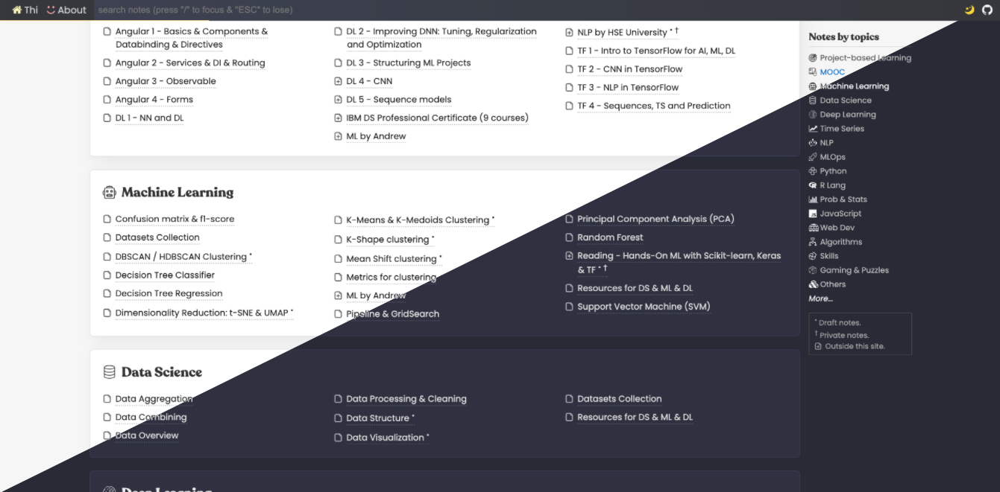
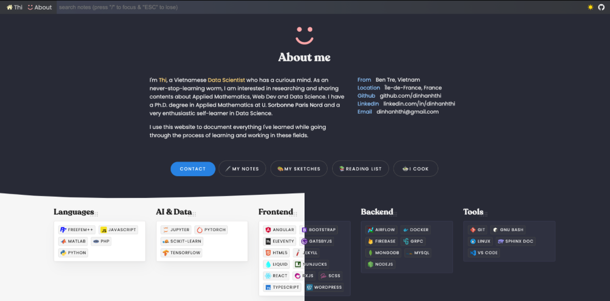
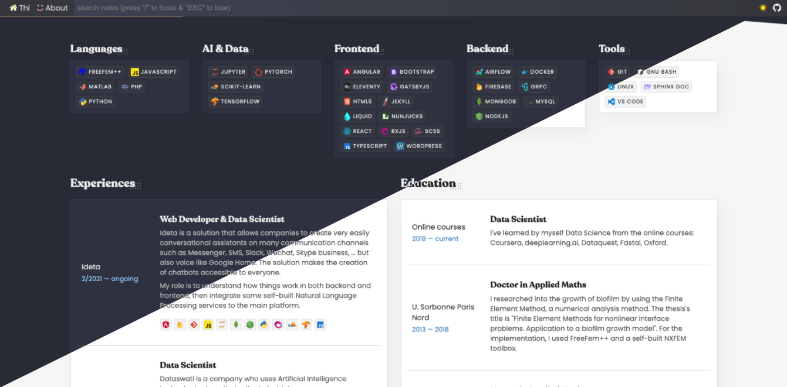
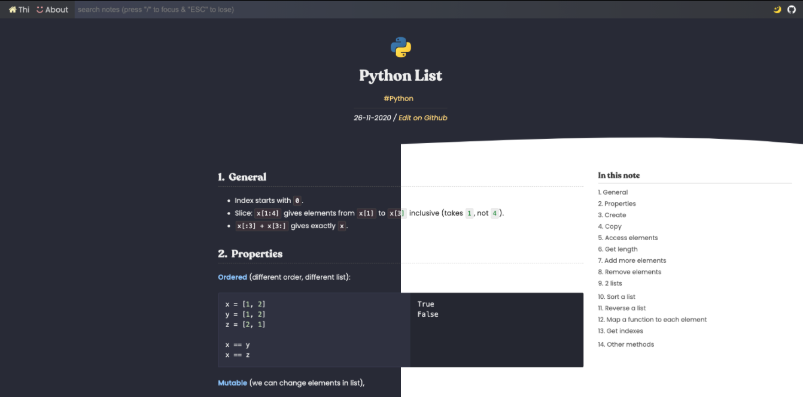

# dinhanhthi.com in 11ty [](https://app.netlify.com/sites/inspiring-goldstine-cfc130/deploys)

⭐  __Demo__ (current version): https://dinhanhthi.com/ <br />
🚀  __Performance__: [Google Insight](https://developers.google.com/speed/pagespeed/insights/?url=https%3A%2F%2Fdinhanhthi.com). <br />

⛑  __Dev branch__: [`dev`](https://github.com/dinhanhthi/dinhanhthi.com/tree/dev) (working branch, always up-to-date) <br />

## Changelog

Read this [changelog](./CHANGELOG.md).

## Older versions

There are several "old" versions (mainly built on **Jekyll**) with different themes.

👉 Version 0 (Jekyll): [v0.dinhanhthi.com](https://v0.dinhanhthi.com) -- [source](https://github.com/dinhanhthi/dinhanhthi.com/tree/v0-jekyll).<br />
👉 Version 1 (Jekyll): [v1.dinhanhthi.com](https://v1.dinhanhthi.com) -- [source](https://github.com/dinhanhthi/dinhanhthi.com/tree/v1-jekyll).<br />
👉 Version 2 (Jekyll): [v2.dinhanhthi.com](https://v2.dinhanhthi.com) -- [source](https://github.com/dinhanhthi/dinhanhthi.com/tree/v2-jekyll).<br />

## Features

1. High performance (customized from [Google's high performance theme](https://github.com/google/eleventy-high-performance-blog)).
2. Flexible on all devices.
3. Support many components for note taking in markdown (my styles 😉)
4. A ustomizable resume page.
5. Optimization images, html, css, javascript files.
6. Support instant search with hightlight (using [elasticlunr](http://elasticlunr.com/))
7. **[NEW]** Support Dark / Light Modes with a toggle button.
8. **[NEW]** Auto scrolling + expanding the TOC. When you scroll to some H2 heading, it will expand all of its H3 children if available. Try [this page](https://dinhanhthi.com/confusion-matrix-and-f1-score/) for an example.

## Illustrated photos (dark vs light)











## Build & dev locally

At the first time after cloning,

``` bash
# Install nodejs
# https://github.com/nodesource/distributions/blob/master/README.md#installation-instructions

npm i # run once

sh getting_start.sh # run once (for me only)
```

``` bash
# If you have any problem with the installation sharp?
# Try to change the python path to python2
# Best practice: create a python env containing python just for this task!

# In case you have python2 installed but it's not currently default
# You can choose python version in npm with
npm config set python python2
```

``` bash
# If you have problems with libvips (MacOS??)?
# install it first
brew install vips
# then again,
npm i
```

**For you only**,

``` bash
# Build & watch locally
npm run share:local-watch
# Go to http://localhost:8080 to see the result

# Build site (optional, take longer time with optimizing images)
npm run share:build

# In case you wanna publish the site using netlify, for example,
# 1. Make a "notes" folder (with this name!) containing your markdown notes
# 2. Configure on netlify to run with "share:build"
# 3. Search and replace { "notes/img": "img" } with { "img": "img"} where ./img/ is the place
#   you store your images
# Advanced: you can modify package.json & .eleventy.js for your personal commands if you want.
```

**For me only** (If you wanna understand what I'm doing, [ask me](mailto:dinhanhthi@gmail.com)!),

``` bash
sudo npm install http-server -g

# Create _live & Clone dat.com/_site
sh getting_started.sh

# Local watch (for developing theme)
npm run local:watch # using sample notes
npm run local:watch-full # using real notes
# Goto http://localhost:8080

# Local serve (see a full remote page locally)
# Remark: Make sure running "npm run build" at least once!
npm run local:http-serve
# It will serve a full site locally
# Go to http://localhost:8081
# Each time wanna update the changes (eg. posts)
npm run build

# Update site (publish to _site and netlify)?
sh ud_site.sh
```

**(For me only)** Make a shortcut on the system?

``` bash
update_dat='cd ~/git/dinhanhthi.com && sh ud_site.sh && cd -1'
```

### Re-install?

In case you have some problems and need to re-install everything,

``` bash
npm run re-install
```

It will remove `node_modules/`, `package-lock.json` and re-run `npm i`.

### Update Fontello icons?

Upload the config file in `/src/fontello/config.json` to [fontello.com](https://fontello.com/) (by clicking on the spanner symbol). Add more icons you want. After choosing, click to "**Get config only**".

``` bash
# install fontello-cli
npm install -g fontello-cli

# install / update new icon
fontello-cli --config src/fontello/config.json --css src/fontello/css --font src/fontello/font install

# check code in src/fontello/config.json
```

**Add a custom icon**?

1. Search for an icon (eg. svg images) + download to local.
   1. Free SVG icon: [site](https://uxwing.com/).
   2. If you need to crop some images? Use [this site](https://www.iloveimg.com/crop-image).
   3. Need to convert to svg? Use [this site](https://www.pngtosvg.com/).
2. Drag and drop this icon to fontello site.

## Errors?

``` bash
# 'darwin-arm64v8' binaries cannot be used on the 'darwin-x64' platform
rm -rf node_modules/sharp
npm  i
# or: https://bit.ly/3kyzXiL
# npm install --arch=x64 --platform=darwin sharp
```

``` bash
# connect EADDRNOTAVAIL 127.0.0.1:8080 - Local (192.168.1.109:50781)
# (Usually after install WARP on MacOS)
sudo ifconfig lo0 -alias 192.0.2.2
```