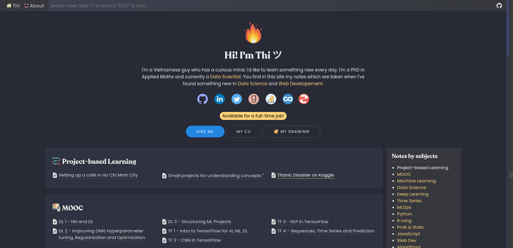
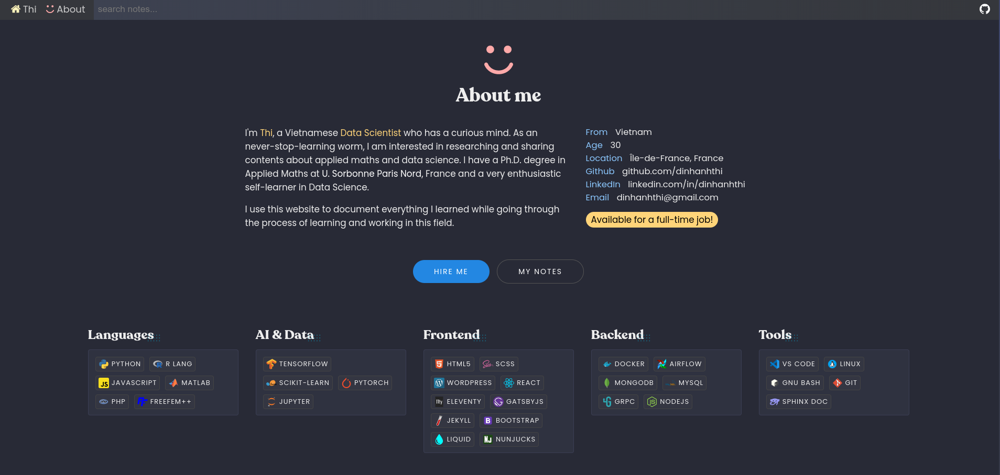
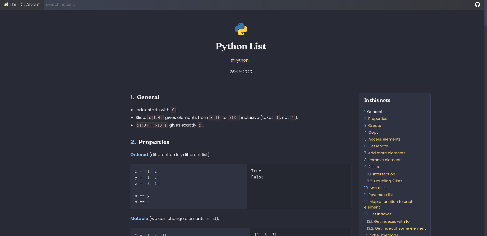

# dinhanhthi.com in 11ty [](https://app.netlify.com/sites/inspiring-goldstine-cfc130/deploys)

⭐ __Demo__: https://dinhanhthi.com/ <br />
🚀 __Performance__: [Google Insight](https://developers.google.com/speed/pagespeed/insights/?url=https%3A%2F%2Fnew.dinhanhthi.com). <br />







## Features

1. High performance (customize from [Google's high performance theme](https://github.com/google/eleventy-high-performance-blog)).
2. Flexible on all devices.
3. Support many components for note taking in markdown (my styles ;))
4. Customize Resume page.
5. Optimization images, html, css, javascript files.
6. Support instant search with hightlight (using [elasticlunr](http://elasticlunr.com/))

## Build

``` bash
# install nodejs
# https://github.com/nodesource/distributions/blob/master/README.md#installation-instructions

npm install

# build + watch + test (locally + WITH performing tasks on images)
npm run watch

# Setting up on Netlify
npm run build
```

## Dev locally

Because of the weakness of eleventy, we have to do below things to make the dev locally much faster!

``` bash
# Install http-server to make a separated server
# (we don't intend to serve our eleventy site, just build it)
sudo npm install http-server -g

# Run the serve on folder _live
npm run local-serve

# Each time we want to build, run
npm run local-build
```